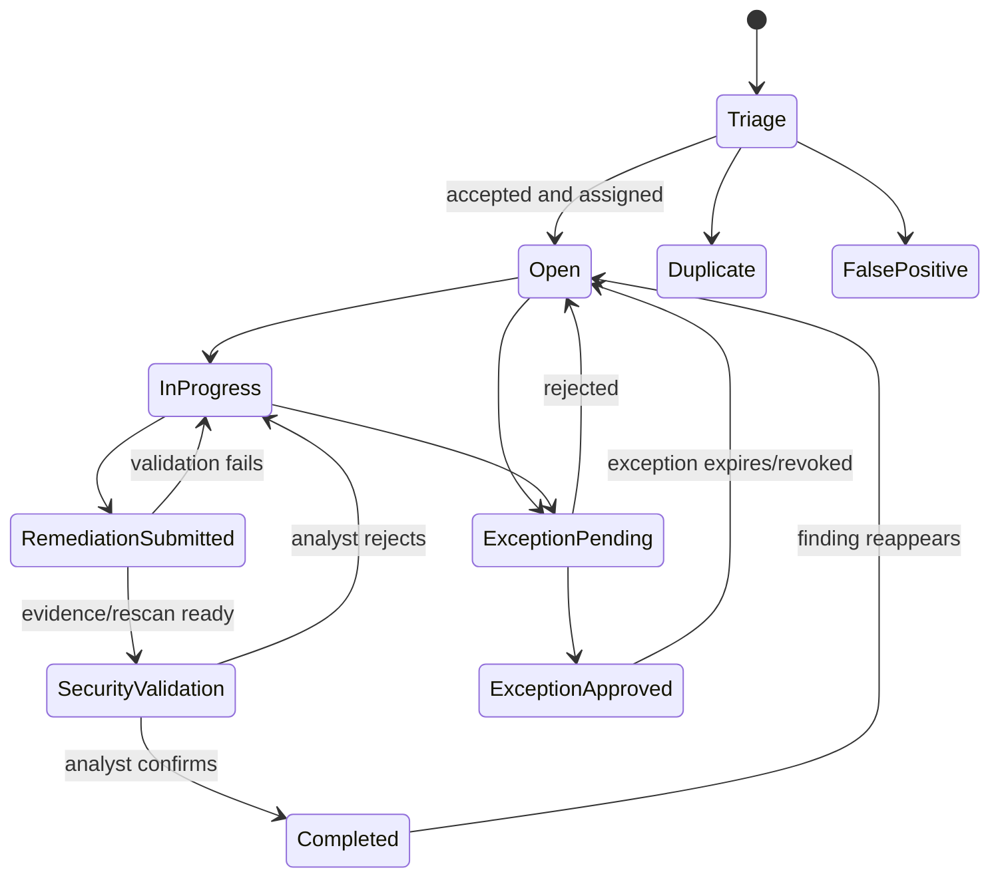
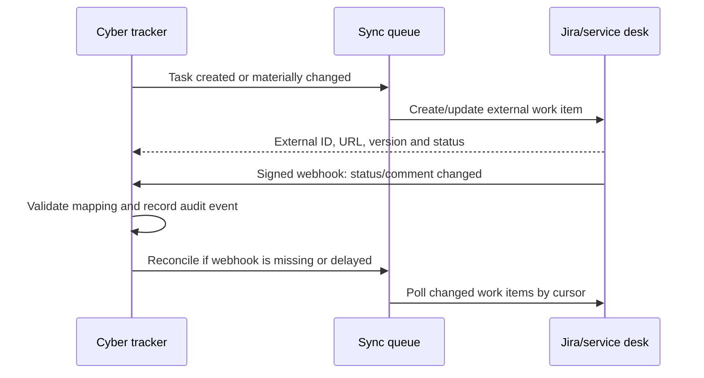
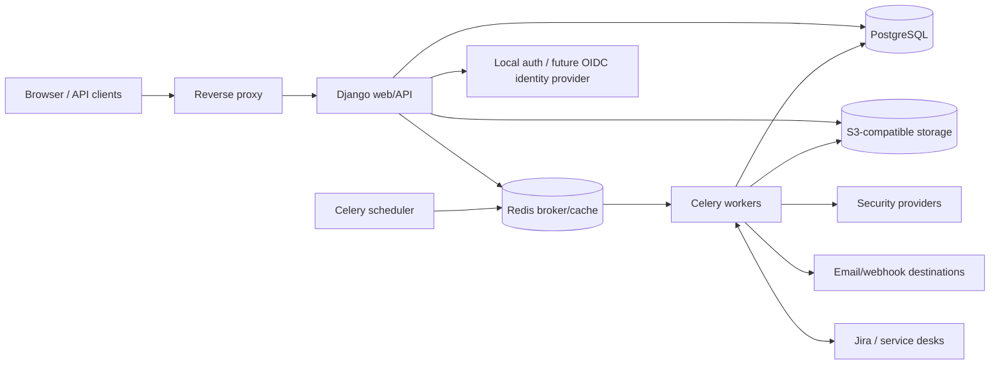
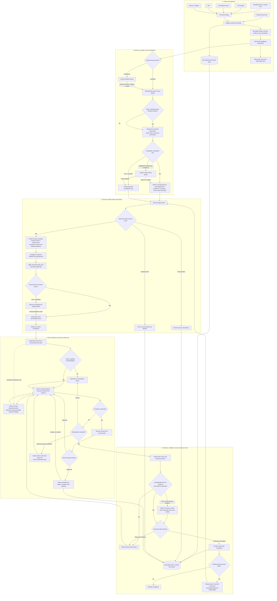
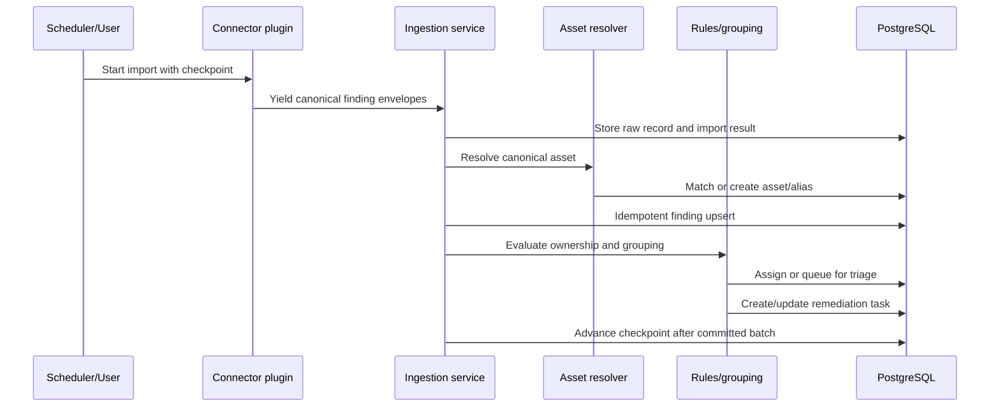

# Cyber Security Tracking and Collaboration Platform

Status: Proposed  
Audience: Product, security, engineering, infrastructure, and operations teams  
Document version: 1.0  
Last updated: 2026-09-02

## 1. Executive summary

This document proposes a web-based platform that imports security findings from external scanners and services, normalises them, assigns them to the correct owners, groups findings that share a remediation, and tracks the resulting work through remediation or an approved exception.

The system will initially support SecurityScorecard, Wiz, Nessus, and CSV uploads. Its connector model will allow future sources to be added without changing the core workflow. Imported findings and manually entered issues become tracked remediation tasks. Tasks are classified as either Product Code or Infrastructure, receive policy-driven due dates, and retain a complete audit history of ownership, progress, evidence, exceptions, and completion.

The recommended implementation is a modular Django application backed by PostgreSQL, with Celery and Redis for asynchronous work. It is packaged as Docker containers and can run initially through Docker Compose, then in Kubernetes or another container platform without redesigning the application.

## 2. Goals and non-goals

### 2.1 Goals

- Provide one authoritative view of security remediation work across multiple finding sources.
- Preserve source evidence while mapping each source into a stable, vendor-neutral model.
- Match assets/endpoints to owners using configurable, explainable rules.
- Convert one or more related findings into actionable remediation tasks.
- Group CVEs and patch findings when one change is expected to resolve them together.
- Separate Product Code and Infrastructure tasks while supporting a consistent workflow.
- Calculate target dates using configurable policies, severity, task type, and contextual risk.
- Allow owners to report progress, supply evidence, revise forecasts, and complete work.
- Support time-bound risk exception requests with review, approval, and expiry.
- Retain a strong audit trail and provide operational and compliance reporting.
- Make new integrations installable and maintainable as isolated connector plugins.

### 2.2 Non-goals for the first release

- Replacing vulnerability scanners or independently determining exploitability.
- Automatically applying patches, changing cloud resources, or modifying source code.
- A full IT service-management or project-management suite.
- Arbitrary executable third-party plugins uploaded through the web interface.
- Native mobile applications.
- A public, multi-tenant SaaS control plane. The first deployment serves one organisation, while retaining organisation/business-unit boundaries that do not prevent a later multi-tenant evolution.

### 2.3 Confirmed product decisions

The following decisions were confirmed during design review and should be treated as current requirements:

- The initial deployment serves one organisation, with reporting and permission scopes by business unit, product, team, and asset group.
- There is currently no authoritative CMDB or service catalogue. The first release must work without one, while leaving a supported enrichment interface for a future CMDB, Backstage, ServiceNow CMDB, or internal catalogue.
- Findings that cannot be assigned by an ownership rule remain unassigned in a security-analyst review queue; the system must not guess a default owner.
- Tasks have both an owning team and one accountable owner. Work may be delegated through Jira or ServiceNow without requiring every assignee to be a platform user.
- When any source reports a consolidated exposure as resolved while another source does not, the task is marked for analyst review rather than automatically completed.
- Cross-source merge candidates require analyst approval during initial operation. Automatic merging can be enabled later only per reviewed rule/confidence class after measured accuracy is acceptable.
- If consolidation encounters multiple existing external tickets, an analyst chooses how the tickets are handled.
- Jira and ServiceNow are the first external work-management targets. The exact externally editable field set remains to be decided.
- Risk exceptions require approval from the designated Risk Executive.
- Policy clocks may be paused for approved maintenance freezes, vendor dependencies, planned decommissioning, and approved exceptions. All pauses require a reason, evidence where applicable, start/end timestamps, and audit history.
- Executive reports are required monthly, quarterly, and yearly. Priority measures are total risk, overdue work, business-unit risk, and recurring vulnerabilities.
- Compliance reporting and audit evidence must support ISO 27001, SOC 2, and NIST-aligned control mapping.
- Retention is configurable by record class and defaults to three years.
- Jira, ServiceNow, notifications, and emailed reports default to a non-sensitive summary followed by an authenticated platform link. Authorised administrators may opt into sharing additional details per destination.
- Manually entered issues remain separate from imported findings unless an analyst explicitly merges them.
- The first-release pilot succeeds when an initial team is fully onboarded and able to operate its agreed workflow.
- The initial release uses secure local accounts. The identity model must permit later OIDC/SAML adoption without replacing user ownership or audit history.
- Policy deadlines use calendar days.
- A fresh qualifying rescan moves a task into security validation but never completes it by itself. An authorised security analyst is the final gatekeeper for completion. If the issue subsequently resurfaces, the existing task automatically reopens.
- Compliance mappings cover both NIST Cybersecurity Framework 2.0 and NIST SP 800-53, alongside ISO 27001 and SOC 2.
- The expected initial workload is fewer than 10,000 active findings. The first release is sized and tested for at least 50,000 active findings to provide growth headroom without premature distributed architecture.
- The platform is an open-source project. Core ingestion, workflow, reporting, audit, grouping, and integration extension points must be usable without proprietary platform components.
- The project is licensed under the Apache License, Version 2.0 (`Apache-2.0`). Contributions use the same licence unless explicitly documented otherwise.
- The OWASP Risk Rating Methodology is the source of truth for task risk and severity. A security analyst completes or approves the assessment during triage; approved high-confidence rules may automate it with full provenance and review controls.
- Remediation policy clocks start from the first qualifying import/observation, not completion of triage or owner acknowledgement. Triage delays remain visible in policy reporting.
- Owner acknowledgement requires an explicit platform action or an explicitly mapped Jira/ServiceNow acknowledgement; viewing a task alone is not acknowledgement.
- The default escalation ladder is accountable owner, owning-team lead, business-unit owner, Security leadership, then Risk Executive.
- When a grouped task is only partially remediated, Security can split unresolved findings into a continuation task while preserving links and the complete original history.
- Approved exceptions remain visible as active accepted risk and are never represented as completed remediation.
- Internal Security notes are restricted from task owners and external destinations; collaborative comments are stored separately.

## 3. Users and roles

| Role | Primary capabilities |
|---|---|
| Platform administrator | Configure tenants, authentication, integrations, policies, fields, and platform settings. |
| Security administrator | Manage severity mappings, assignment/grouping rules, exception workflows, and security reporting. |
| Security analyst | Review findings, resolve ambiguous assets, triage tasks, adjust grouping, and validate remediation. |
| Product owner | Own Product Code tasks, plan remediation, add progress, delegate work, and request exceptions. |
| Infrastructure owner | Own Infrastructure tasks and coordinate endpoint, image, operating-system, and service remediation. |
| Exception approver | Assess risk exception requests and approve, reject, revoke, or request changes. |
| Auditor/read-only user | View records, evidence, policies, and immutable event histories without making changes. |
| Integration service account | Submit imports and update integration state through narrowly scoped API credentials. |

Permissions should be role-based with optional scope restrictions by business unit, product, team, asset group, or tenant. A user may hold multiple roles.

## 4. Core concepts

It is important to separate what a source observed from the work the organisation performs:

- **Finding**: A normalised observation imported from a source or entered manually. It retains source-specific data and evidence.
- **Asset**: The affected entity, such as a host, cloud resource, repository, application, container image, domain, or IP address.
- **Issue**: A security concern that may contain one or more findings. For simple cases, an issue is created automatically and remains invisible as a separate UI concept.
- **Remediation task**: The unit assigned to an owner and tracked through a workflow. One task can resolve many findings.
- **Resolution group**: The reason a set of findings can share one task, such as upgrading Apache on a particular endpoint.
- **Policy**: Versioned rules that calculate response and remediation dates.
- **Exception**: A time-bound, approved acceptance or deferral of risk for a task or selected findings.
- **Ownership rule**: A priority-ordered predicate that maps a finding or asset to a team and optional individual.

Findings must never be overwritten by task state. A finding may be reopened by a later scan even if its previous remediation task was completed.

## 5. Functional requirements

### 5.1 Integration and ingestion

Each integration must support:

1. Scheduled polling and an operator-triggered synchronisation.
2. Cursor, timestamp, or page-based incremental imports where the provider allows it.
3. Idempotent reprocessing using a stable source finding identifier and source account.
4. Raw payload retention for troubleshooting and audit, subject to a retention policy.
5. Normalisation of severity, status, asset identity, CVE/CWE identifiers, timestamps, evidence, and remediation guidance.
6. Import-run metrics, structured errors, retry policy, and dead-letter handling.
7. Detection of findings no longer observed by a source, without immediately treating them as remediated.
8. Credential testing, health status, and least-privilege setup guidance.

Initial connectors:

- **SecurityScorecard**: ratings/issues, factors, domains or digital-footprint assets, evidence, and issue status.
- **Wiz**: vulnerability/issues, cloud-resource metadata, subscriptions/accounts/projects, exposure context, and remediation guidance.
- **Nessus/Tenable**: scan findings, plugin IDs, CVEs, host identifiers, ports/services, plugin output, and solution text.
- **CSV**: user-defined column mapping, preview and validation, downloadable error file, saved mapping templates, and import provenance.
- **Manual entry**: the same normalised validation path as a connector, with attachments and links as evidence.

Provider API details and licences must be validated during connector discovery. The connector contract must not assume every provider exposes identical fields or deletion semantics.

### 5.2 Asset identity and ownership

Asset reconciliation is a prerequisite for reliable assignment and grouping. The platform will maintain a canonical asset plus aliases observed from each source.

Identity precedence should be configurable by asset type. A representative host strategy is:

1. Cloud provider resource ID, agent ID, or stable scanner asset UUID.
2. Organisation-managed CMDB ID.
3. Fully qualified domain name plus environment/account context.
4. MAC address where appropriate.
5. IP address plus network/account context, treated as a weak and potentially temporary identity.

Ambiguous matches enter an asset-resolution queue and are not silently merged. Operators can merge or split assets, and every decision is audited.

Ownership rules are ordered by priority and can inspect:

- source and source account;
- asset type, hostname, domain, IP/CIDR, port, operating system, tags, labels, cloud account, subscription, project, region, or resource group;
- application, repository, component, package, image, environment, or business unit;
- finding category, CVE/CWE, provider rule ID, or task type;
- optionally, a CMDB or internal catalogue attribute.

A rule produces a team, optional user, task type, policy override, and explanatory label. The UI must provide a dry-run tester, match counts, conflict detection, and an explanation such as: `Assigned to Web Platform because cloud_account=production and tag.service=checkout`.

Rules use first decisive match by explicit priority. If no rule matches, the finding remains unassigned in a security-analyst review queue. It must not be sent to a guessed or generic business owner. Changes to rules do not automatically reassign existing open tasks unless an authorised user runs and previews a bulk reassignment.

Security analysts own the triage queue and may correct classification, consolidate/split work, complete the OWASP risk assessment, select policy, assign or reassign the owning team/accountable owner, define acceptance criteria, and confirm the target calculated from the already-running remediation clock. Assignment automation proposes or applies routing according to approved rules, but Security retains oversight and can intervene with an audited reason.

### 5.3 Classification

Every task has exactly one primary type:

- **Product Code**: remediation normally requires changing source code, application dependencies, build configuration, or a product-owned deployment artifact.
- **Infrastructure**: remediation normally requires changing hosts, operating systems, base images, network devices, cloud configuration, middleware, or platform-managed runtime services.

Rules may propose the type. Owners or security analysts may correct it with a reason. Optional labels provide finer categories without expanding the primary type enum.

### 5.4 Grouping findings into remediation tasks

The grouping objective is to create the smallest sensible unit of work, not merely group matching CVE numbers. The initial deterministic strategy is:

1. Findings must affect the same canonical asset or the same explicitly managed deployment unit.
2. Findings must share a normalised remediation action, normally package plus target version or provider remediation fingerprint.
3. Findings must have compatible owners, task type, maintenance scope, and due-date policy.
4. Findings under incompatible exceptions or lifecycle states must not be automatically combined.

Example: CVE-2025-X, CVE-2025-Y, and CVE-2026-Z all affect the installed `apache/httpd 2.4.49` package on host A and are resolved by upgrading it to at least 2.4.58. They generate one task: **Upgrade Apache on host A to 2.4.58 or later**, linked to all three findings.

A provisional grouping key can be represented as:

```text
tenant
+ canonical_asset_or_deployment_unit
+ task_type
+ normalized_component_ecosystem_and_name
+ normalized_remediation_action_or_fixed_version
+ owner_team
+ policy_compatibility_bucket
```

Connector normalisers may propose `component`, `installed_version`, `fixed_version`, and a `remediation_fingerprint`. The core grouping service owns the final decision. If fixed-version data is missing or contradictory, the system recommends a group but requires analyst confirmation.

Users must be able to split a group, merge compatible tasks, exclude a finding, lock a manually curated group, and see why the group was suggested. On every subsequent import, the system re-evaluates unlocked open groups idempotently. A task's effective severity and due date are recalculated from the highest-priority active finding unless policy explicitly defines another aggregation method.

If some findings in a grouped task are validated as remediated while others remain active, the task is not silently treated as complete. Security receives a split preview and may create a linked continuation task for the unresolved scope. The original task retains its source links, decisions, work history, and partial-validation events; the continuation records why and when scope moved, inherits the appropriate risk/policy context, and receives a separately calculated deadline according to the approved continuation policy.

Machine-learning or embedding-based similarity may later assist recommendations, but it must not make unreviewable grouping decisions in the first release.

#### 5.4.1 Cross-source finding and task consolidation

The same exposure may be reported independently by Wiz, Nessus, SecurityScorecard, a CSV upload, and manual entry. The system must consolidate the resulting work across sources without discarding source provenance or pretending that differently scoped observations are identical.

Consolidation has two levels:

1. **Canonical observation matching** links source findings that describe the same vulnerability/component on the same canonical asset. Every original source finding remains independently stored with its own evidence, severity, timestamps, and source status.
2. **Remediation-task consolidation** links canonical observations to one task when they share the same owner and actionable resolution. This can merge tasks created before a later source was imported.

An exact or high-confidence candidate uses a versioned cross-source fingerprint based on stable normalised attributes:

```text
tenant
+ canonical_asset_or_deployment_unit
+ vulnerability_identity (CVE/provider-independent control where available)
+ component_ecosystem_and_name
+ installed_version_or_configuration_state
+ affected_port/service/path where remediation scope depends on it
+ normalized_remediation_action_or_compatible_fixed-version range
```

The source name and source finding ID are deliberately excluded from this fingerprint. Source-independent package aliases, such as `httpd` and `apache2`, are maintained in a reviewed component-alias catalogue. Version ranges are compared semantically for their ecosystem rather than as strings.

Matching confidence is classified as:

- **Exact**: same canonical asset, CVE/control, component, affected instance, and compatible resolution. It is presented for analyst approval initially; administrators may later enable automatic consolidation for a proven match rule/version.
- **Probable**: some strong identifiers match but a version, instance, or resolution attribute is missing. It is suggested in a review queue.
- **Conflicting**: evidence indicates different installations, ports, environments, owners, or incompatible fixed versions. It remains separate and shows the conflict reason.
- **Unrelated**: insufficient common scope; no merge is proposed.

When equivalent open tasks already exist, the system proposes a deterministic survivor—normally the oldest task with active work or an external ticket—and previews movement of the other task's findings, comments, evidence, watchers, external links, and history references. An analyst approves or changes the survivor. The retired task receives a `Merged` disposition and a permanent link to the survivor; it is never deleted. If multiple Jira or ServiceNow items already exist, the analyst must choose whether to retain all items, select a primary and mark others as duplicates, or cancel the merge. No remote item is silently closed.

The consolidated task displays a source coverage panel containing every provider record, last-seen time, severity, source status, and evidence link. Its effective risk uses the highest applicable normalised severity/risk unless policy defines a transparent alternative. Conflicting source severities are retained and visible.

Resolution is conservative: one provider reporting `fixed` or ceasing to report a record does not close the task while another source still reports the exposure or has not supplied sufficiently fresh confirmation. Any disagreement in source resolution state sets `Resolution review required` and places the task in the analyst validation queue. Validation policy defines source freshness and how sources that cannot report closure are handled. A later recurrence attaches to and reopens the existing task where appropriate instead of creating duplicate work.

Analysts can preview, approve, reject, split, or lock consolidation decisions. Rejected matches create a durable negative-match rule for those source records or fingerprints so scheduled imports do not repeatedly propose the same incorrect merge. Every automatic or manual decision records the fingerprint version, confidence, matched fields, conflicts, actor, and before/after task links in the audit trail.

Manually entered issues are excluded from automatic cross-source matching. An analyst may explicitly compare and merge one with imported observations; the preview must show all source and manual content, and the manual record's origin and audit history remain intact after merging.

### 5.5 Task workflow

Recommended task states:



`FalsePositive` and `Duplicate` require a reason and suitable permission. They are dispositions rather than deletion.

Only an authorised security analyst can transition a task to `Completed`, `FalsePositive`, or `Duplicate`. Owners can acknowledge, update progress, change forecasts, add evidence, and submit remediation for validation, but cannot assert final security closure. Automated processes can attach validation evidence and move an eligible task to `SecurityValidation`; they cannot perform the final transition.

Each task includes:

- human-readable key and title;
- type, severity, risk score, status, labels, and policy version;
- owner team, accountable user, watchers, and optional collaborators;
- affected assets and linked findings;
- recommended resolution and acceptance criteria;
- created, assigned, acknowledgement, target, forecast, submission, validation, and completion timestamps;
- progress updates with percentage or structured status, comment, blockers, next step, and forecast date;
- evidence attachments and external links;
- parent/child relationships for work that must be subdivided;
- immutable event history.

The accountable owner remains singular even when collaborators or child tasks are used. Parent completion requires all required children and findings to be resolved, dispositioned, or covered by a valid exception.

For imported findings, a fresh qualifying rescan showing all findings resolved and satisfying the multi-source validation policy moves the task to `SecurityValidation`. A source disagreement also routes to security review with the conflict highlighted. The analyst reviews evidence, scope, grouping, source freshness, acceptance criteria, and any remaining exposure before confirming completion or returning the task to `InProgress` with a reason. The completion event records the analyst, observations, source timestamps, freshness checks, evidence, and policy version used. If any linked finding is later observed active again, the same task automatically transitions from `Completed` to `Open`, retains its prior completion history, records a recurrence count, recalculates its policy dates, and notifies Security and the owner. Manual-only issues follow the same analyst gate using evidence-based validation.

### 5.6 Security-led remediation follow-up

The cybersecurity team manages the full lifecycle from intake to verified closure. Every open task has a security triage/oversight state in addition to its accountable delivery owner. Security can see which work needs initial triage, owner acknowledgement, progress, escalation, validation, or exception review.

During triage, Security must be able to:

- review and correct asset identity, source normalisation, duplicates and grouping;
- complete or approve the OWASP assessment and confirm task type/policy;
- set acceptance criteria and the evidence needed for closure;
- assign the owning team and accountable owner, or deliberately leave it unassigned with a reason;
- create the Jira/ServiceNow projection and record the expected communication channel;
- record a triage decision and release the task into active remediation.

The policy clock starts at the first qualifying source observation/import timestamp. Triage records its own duration, but finishing triage or obtaining owner acknowledgement does not reset or defer the remediation target. An owner acknowledges through an explicit platform command or a destination status/action explicitly configured as equivalent; views and notification delivery do not count.

During remediation, Security must be able to:

- view a work queue ordered by severity, policy breach risk, lack of acknowledgement, stale progress, exception expiry, and validation readiness;
- record a follow-up interaction by email, meeting, phone, platform comment, Jira, or ServiceNow;
- capture contact, outcome, commitment, blocker, next action, promised date, and next follow-up date;
- request an owner update or additional evidence without changing task ownership;
- schedule reminders and receive a personal/team follow-up queue;
- bulk-send approved reminder templates while logging one auditable interaction per task;
- escalate to team lead, business-unit owner, Security leadership, or Risk Executive using configurable thresholds;
- reassign work, correct policy, recommend an exception, or return insufficient remediation to the owner;
- see remote ticket status and synchronisation health without treating the external system as the security authority.

A task is `Stale` for follow-up purposes when it has no qualifying progress update or owner interaction within a configurable interval. Staleness is a derived flag, not a lifecycle status. Reminder and escalation policies can depend on severity, acknowledgement state, days to/past target, last meaningful progress, broken commitment, and number of prior follow-ups. Automated reminders must be rate-limited, deduplicated, templated, and suppressible with an audited reason.

Unless a reviewed policy overrides it, escalation proceeds from accountable owner to owning-team lead, business-unit owner, Security leadership, and finally the Risk Executive. Skipping a level requires a recorded reason; Critical urgency or a severely overdue task may trigger a policy-defined accelerated path.

The platform maintains a chronological collaboration timeline combining owner progress, Security follow-ups, commitments, evidence requests, external-ticket events, policy escalations, exceptions, scan evidence, and validation decisions. Collaborative comments and internal Security notes are distinct record types. Internal notes are visible only to authorised Security/audit roles and must never be projected to owners, notification recipients, or external destinations.

Dashboards for Security include untriaged/unassigned work, overdue acknowledgements, stale tasks, commitments due or missed, follow-ups due today, escalation level, tasks awaiting security validation, rejected remediations, recurring issues, and owner/team response patterns. Metrics must distinguish productive follow-up from message volume; the objective is verified remediation, not maximising contacts.

### 5.7 OWASP risk assessment

The [OWASP Risk Rating Methodology](https://owasp.org/www-community/OWASP_Risk_Rating_Methodology) is the canonical method for determining every task's risk and severity. Provider severity, CVSS, EPSS, exploit intelligence, asset criticality, and internet exposure are evidence inputs; they do not directly replace the OWASP result.

The methodology is applied as follows:

1. Define the risk scenario, affected business capability, plausible threat agent, attack path, vulnerability, and consequence. Use the credible worst-case scenario when several apply.
2. Score the four threat-agent factors from 0–9: skill level, motive, opportunity, and size.
3. Score the four vulnerability factors from 0–9: ease of discovery, ease of exploit, awareness, and intrusion detection.
4. Calculate overall likelihood as the arithmetic mean of the eight likelihood factors, retaining the unrounded decimal. Map `0 to <3` to Low, `3 to <6` to Medium, and `6 to 9` to High.
5. Score technical impact from 0–9 for loss of confidentiality, integrity, availability, and accountability, then calculate its arithmetic mean.
6. Where sufficiently supported, score business impact from 0–9 for financial damage, reputation damage, non-compliance, and privacy violation, then calculate its arithmetic mean. Business impact is used as overall impact when reliable business information exists; otherwise technical impact is used and the assessment is marked `Technical impact fallback`.
7. Map overall impact to Low, Medium, or High using the same numeric bands, then use the OWASP likelihood-impact matrix to derive Note, Low, Medium, High, or Critical task severity.

The unmodified initial severity matrix is:

| Impact \\ Likelihood | Low | Medium | High |
|---|---|---|---|
| High | Medium | High | Critical |
| Medium | Low | Medium | High |
| Low | Note | Low | Medium |

Every factor records numeric value, selected rubric option, rationale, evidence references, author/origin, confidence, and timestamp. An assessment also records methodology version, organisation rubric version, calculation results, whether business or technical impact controlled the result, and the task/finding snapshot assessed. Decimal arithmetic and explicit rounding rules are used; displayed rounding must not alter band selection.

#### Analyst triage and reassessment

A new task enters triage with `Risk assessment pending` unless an approved automation rule produces a complete assessment. A security analyst may enter factor scores, accept or modify proposed scores, and approve the assessment. Changes create a new immutable assessment version; they do not overwrite the prior assessment. A change in asset criticality, exposure, exploit evidence, grouping, business context, or recurrence can mark the assessment stale and return it for review.

When one task covers multiple findings, assess each materially different risk scenario. The task's governing severity is the highest current OWASP severity among its active scenarios. Do not average risks across findings, assets, or sources because that can conceal a high-risk scenario. Equivalent cross-source findings share a scenario rather than multiplying risk.

Analyst overrides are permitted only by authorised security roles and require a rationale. The system recalculates the result from factors; an analyst cannot directly select a preferred final severity without recording an approved exception to the methodology. Any organisational customisation of factors, options, weights, or matrix is a versioned Risk Methodology Profile requiring security and Risk Executive approval.

#### Controlled automation

Automation uses versioned rules that map trustworthy evidence to OWASP factor values. A rule declares applicable sources/finding types, required fields, confidence threshold, factor mappings, evidence freshness, exclusions, and whether it proposes or approves an assessment.

- Partial or lower-confidence mappings pre-populate factors for analyst review.
- Full automation is allowed only when every required factor is supported, the rule/class has been approved, and its measured accuracy meets an agreed threshold.
- Missing business context defaults to technical-impact fallback; it must never be fabricated.
- Source severity alone cannot generate an approved OWASP assessment.
- Conflicting or stale inputs prevent automatic approval and enter the analyst queue.
- Analysts can inspect why every factor was selected, override it with a reason, and disable a faulty rule.
- Automated assessments are sampled periodically; false-rating and override rates are reported by rule/version.

Policy due dates use the resulting OWASP severity. A reassessment that changes severity produces an impact preview before recalculating an existing task's deadline, except an approved policy may automatically shorten a deadline for an escalation. Deadline history remains immutable.

Executive `Total Risk` reporting means the current distribution and count of unique active risk scenarios by OWASP severity, with trends and business-unit breakdowns. The OWASP methodology does not define an additive portfolio score, so the platform must not label a custom sum as OWASP Total Risk. If an organisation later approves a portfolio index, it is separately named, formula-versioned, and always accompanied by the underlying OWASP severity distribution.

### 5.8 Policy timelines and service-level objectives

Policies are versioned and effective-dated. A policy can match task type, severity, environment, internet exposure, business criticality, data classification, source, or tags. A policy defines:

- acknowledgement duration;
- remediation duration;
- reminder and escalation thresholds;
- calendar-day durations for acknowledgement, remediation, reminders, and escalation;
- timezone used to determine day boundaries;
- required validators and exception approvers;
- maximum exception duration and renewal limit;
- optional risk modifiers, caps, and overrides.

Example defaults, to be configured rather than hard-coded:

| Severity | Acknowledge | Remediate |
|---|---:|---:|
| Critical | 1 calendar day | 7 calendar days |
| High | 3 calendar days | 30 calendar days |
| Medium | 5 calendar days | 90 calendar days |
| Low | 10 calendar days | 180 calendar days |
| Note | 10 calendar days | No default remediation deadline; analyst disposition required |

The task stores the policy and policy-version snapshot used for its calculation so that later policy edits do not rewrite history. Authorised users may recalculate selected open tasks after reviewing the impact. A policy timer may be paused for an approved maintenance freeze, vendor dependency, planned asset decommissioning, or approved risk exception. A pause is a separate audited period with category, justification, evidence, requester, approver, start, expected end, actual end, and effect on the due date; timestamps are never edited to simulate a pause. Overdue reporting must show both gross elapsed time and policy-adjusted elapsed time.

### 5.9 Exceptions

An exception request records:

- scope: whole task or selected findings/assets;
- business justification and why remediation is not currently viable;
- risk statement and residual risk;
- compensating controls and evidence;
- requested expiry and planned remediation date;
- requester, required approvers, decisions, comments, and timestamps;
- renewal history and maximum permitted renewal count.

Approval is required from the organisation's designated Risk Executive. A delegate may act only through an explicit, time-bound delegation recorded in the audit trail. Separation of duties prevents the requester from approving their own request. Approved exceptions expire automatically, generating reminders before expiry and returning unresolved scope to an actionable state at expiry. Closed or revoked exceptions are immutable; corrections are appended as events.

An approved exception represents active accepted risk, not remediation. The task remains visible in operational and executive exposure, with an `Exception approved` indicator, approved scope, residual risk, compensating controls, and expiry. Reports may present accepted risk separately but must not count it as completed or remove it from total exposure.

### 5.10 Search, dashboards, and notifications

Global search should cover task keys, CVEs, assets, components, owners, source IDs, and free text. Common filters must be bookmarkable and exportable.

Initial dashboards:

- tasks and findings by severity, type, source, owner, product, environment, and status;
- overdue and approaching-due tasks;
- untriaged/unassigned tasks, overdue acknowledgements, stale progress, due or missed commitments, and follow-ups due;
- tasks awaiting security validation and remediation submissions rejected by Security;
- mean time to acknowledge/remediate and policy compliance trend;
- unassigned findings and ambiguous assets;
- approved exceptions and upcoming expiries;
- recurring/reopened findings;
- connector freshness and failed import runs;
- risk reduction over time, clearly distinguishing finding count from task count.

Notifications should be event driven and initially support email plus outbound webhooks. Slack, Microsoft Teams, Jira, and service-management destinations can be plugins. Users need digest and immediate-notification preferences to prevent alert fatigue.

### 5.11 Detailed and executive reporting

Reporting serves two distinct audiences and must not force both into the same presentation.

**Detailed operational reports** are intended for security analysts, task owners, auditors, and service managers. They include:

- finding-level and task-level registers with saved filters and selected columns;
- ageing, overdue, approaching-due, unassigned, reopened, and stalled-work reports;
- policy compliance by team, product, task type, severity, environment, and source;
- asset and component exposure, including grouped CVEs and the remediation task covering them;
- owner activity, latest progress, forecast accuracy, completion evidence, and validation results;
- exception register with scope, compensating controls, approvers, expiry, and renewal history;
- integration freshness, rejected records, unmatched assets, and ownership-rule effectiveness;
- full task and finding histories suitable for audit evidence packs.

**Executive reports** summarise risk and remediation performance without relying on raw finding counts alone. They include:

- current exposure and trend by severity, business unit, product, and environment;
- tasks within policy, approaching breach, overdue, and covered by exceptions;
- risk accepted through exceptions, including concentration and upcoming expiries;
- remediation throughput, median and percentile remediation times, and reopened work;
- top systemic remediation themes, high-risk assets, and ownership hotspots;
- reporting-period changes with concise commentary and data-quality indicators.

The standard executive pack is generated monthly, quarterly, and yearly. Its primary measures are total risk, overdue work, risk by business unit, and recurring vulnerabilities. Definitions must state how severity, asset criticality, internet exposure, accepted exceptions, and duplicate-source consolidation contribute to total risk.

Executives must be able to distinguish: active findings, grouped remediation tasks, accepted risk, remediated findings awaiting validation, and source data that is stale. Every chart links to its filtered underlying records for authorised users.

Reports support interactive HTML, CSV/XLSX for detailed analysis, and branded PDF for distribution. Users can save report definitions and schedule delivery to named recipients or approved distribution groups. Scheduled reports use a fixed `as_of` timestamp, record their filter and metric-definition versions, and store an immutable generated snapshot so the same report can be reproduced later. Access is re-evaluated at generation and delivery time; email should contain a secure link by default rather than sensitive attachments.

Metric definitions, severity mappings, exclusions, and reporting calendars are versioned in a data dictionary. Executive trend data should use periodic snapshots or an event-derived reporting model so historical results do not change when current ownership, policies, or asset metadata are edited. All totals show data freshness and coverage by source.

Report and evidence-pack templates should map relevant records to ISO 27001, SOC 2, NIST Cybersecurity Framework 2.0, and NIST SP 800-53 control references. Crosswalks between frameworks are versioned configuration—not hard-coded claims of compliance—and reports must distinguish platform evidence from an assessor's compliance conclusion.

### 5.12 External work-management and service-desk synchronisation

Teams may work primarily in Jira, Jira Service Management, ServiceNow, Azure DevOps, or similar tools. The platform therefore supports outbound task adapters that create and maintain an external work item while keeping the security platform authoritative for findings, grouping, risk, policy deadlines, exception decisions, and audit history.

Each destination configuration defines:

- target instance, project/queue, issue type, authentication, and permitted scopes;
- which task types, teams, labels, severities, or environments should be exported;
- field templates and mappings for title, description, priority, owner, labels, due date, acceptance criteria, and secure backlink;
- status and resolution mappings in both directions;
- user/team identity mappings and a fallback assignee;
- polling interval, webhook configuration, retry policy, and conflict policy;
- which comments, attachments, and progress fields may cross the boundary.

The default outbound template contains a non-sensitive summary, task key, severity band where permitted, required action, target date, and authenticated link back to the platform. Detailed vulnerability evidence, asset identifiers, exception content, and attachments are omitted by default. Administrators may enable individual data classes for a specific destination/project after a documented data-classification review; previews show exactly what will be disclosed before activation.

The normal lifecycle is:



External systems may update mapped operational fields such as assignee, work status, progress comment, and forecast date. They may not approve exceptions, alter policy calculations, unlink findings, change severity, or mark a security task finally validated. An external `Done` state moves the internal task to `RemediationSubmitted`; final completion requires an authorised security analyst after reviewing scanner or other required evidence. This prevents a closed ticket from silently closing unresolved vulnerabilities.

Until the organisation approves an inbound field-authority matrix, external integration operates in conservative mode: the platform creates and updates remote items and monitors their remote status, but does not mutate internal task fields from remote changes. Remote changes are displayed and audited for analyst review. Inbound synchronisation is enabled field by field per destination after ownership and conflict behaviour are agreed.

Synchronisation requirements:

- asynchronous creation and updates through the transactional outbox, with retries and a dead-letter queue;
- webhook-first monitoring where supported, backed by scheduled cursor-based reconciliation;
- idempotency using the internal task UUID plus destination and remote item ID;
- persisted remote version/ETag and field-level last-synchronised values for conflict detection;
- loop prevention by recording update origin and ignoring equivalent reflected updates;
- visible states such as `Pending export`, `In sync`, `Sync delayed`, `Conflict`, and `Disconnected`;
- an operator repair queue with retry, relink, unlink, and re-create actions, all audited;
- preservation of a remote item's key and URL after deletion, archival, or disconnection;
- rate-limit awareness, exponential backoff, credential-health alerts, and per-destination queue isolation.

Conflict handling is field specific. Security-controlled fields always win. For collaboratively controlled fields, non-conflicting changes merge; simultaneous conflicting changes are surfaced for review rather than silently overwritten. Closing, deleting, or moving an external item never deletes the internal task.

Jira and ServiceNow are the first adapters. Jira establishes the versioned `TaskDestinationAdapter` contract and ServiceNow validates that it is genuinely provider-neutral. Later adapters reuse the same canonical commands and events, while keeping provider-specific workflows, rich-text formats, users, attachments, and rate limits inside the adapter. The UI provides a direct external link and shows last successful synchronisation, remote status, errors, and field conflicts without requiring routine platform login.

External delegation does not require the remote assignee to have a platform account. The internal task retains its owning team and accountable platform owner, while storing the external assignee's provider identity and display name as execution metadata. Changes requiring platform authority still route to the accountable owner or security analyst.

## 6. Proposed architecture

### 6.1 Technology choices

| Concern | Recommendation | Rationale |
|---|---|---|
| Backend | Python 3.13 and Django 5.2 LTS | Strong domain modelling, migrations, auth, admin, validation, and established security practices. Pin the latest supported patch release during implementation. |
| API | Django REST Framework with OpenAPI generation | Mature serializers, permissions, pagination, filtering, and ecosystem. |
| Database | PostgreSQL 17 or supported equivalent | Transactions, JSONB, full-text search, partial indexes, constraints, and mature operational tooling. |
| Background work | Celery with Redis initially | Suitable for imports, retries, grouping, notifications, and scheduled jobs. RabbitMQ may replace Redis as broker at higher scale. |
| Frontend | Django templates + HTMX + TypeScript-enhanced components initially | Fast delivery and fewer distributed-state/API concerns for a workflow application. A React SPA can be introduced if UI complexity demonstrates the need. |
| Styling | Accessible component system using Bootstrap or Tailwind CSS | Consistent responsive UI; select one during prototyping. |
| Object storage | S3-compatible storage | Evidence files, raw payloads, and report exports should not live in database rows or container filesystems. |
| Identity | Django local authentication initially; OIDC/SAML-ready identity abstraction | Enables the first pilot without an external provider while preserving stable users, ownership, and audit attribution during later SSO migration. |
| Observability | OpenTelemetry, Prometheus metrics, structured JSON logs, and Sentry-compatible error tracking | Trace imports and user requests end-to-end without coupling to one vendor. |
| Packaging | Docker images and Docker Compose for development | Reproducible deployment, with a straightforward path to Kubernetes. |

Django is preferred to Flask because this product has extensive relational data, permissions, forms, administration, migrations, and stateful workflows. Flask would require selecting and integrating many more foundational components without providing a clear benefit.

### 6.2 Logical components



Deploy this as a modular monolith first. Suggested Django applications are `accounts`, `tenancy`, `assets`, `integrations`, `findings`, `ownership`, `policies`, `tasks`, `exceptions`, `notifications`, `reporting`, and `audit`. Module boundaries and internal service interfaces should be enforced so workers or high-volume ingestion can be separated later.

### 6.3 Full finding-to-remediation lifecycle

The following is the authoritative end-to-end workflow. The security platform remains the system of record even when delivery teams work from Jira or ServiceNow. Rectangles represent processing or work, diamonds represent decisions, and database shapes represent durable records.



Key control points are:

- source records are never discarded when they are consolidated; the canonical observation and task retain complete provenance;
- ambiguous asset matches, ownership, grouping, risk automation, and source disagreement go to Security rather than being guessed;
- OWASP Risk Rating is assessed or approved by Security and drives the applicable versioned policy;
- owners and external systems can report delivery progress, but only Security can validate final completion;
- an approved exception records active accepted risk and does not close the remediation task;
- recurrence reopens the completed task with its previous history intact.

### 6.4 Technical ingestion sequence



Imports are chunked. A failed batch can retry without duplicating findings or tasks. Checkpoints advance only after the corresponding database transaction succeeds.

## 7. Plugin architecture

### 7.1 Safety boundary

An integration plugin is trusted, reviewed server-side code shipped as a Python package or isolated worker image. Administrators may configure an installed plugin but may not upload and execute arbitrary Python. For third-party plugins, prefer a separate container communicating through a versioned HTTP/event contract, with network and secret access limited to what it needs.

### 7.2 Connector contract

The core defines a versioned interface conceptually similar to:

```python
class Connector(Protocol):
    manifest: ConnectorManifest

    def test_connection(self, config, secrets) -> ConnectionResult: ...
    def discover_schema(self, config, secrets) -> SourceSchema: ...
    def fetch(self, checkpoint, config, secrets) -> Iterator[SourceRecord]: ...
    def normalize(self, record: SourceRecord) -> FindingEnvelope: ...
    def acknowledge(self, checkpoint) -> None: ...
```

The manifest declares connector ID, semantic version, compatible contract versions, configuration JSON Schema, required secret fields, requested outbound hosts, supported object types, incremental-sync capability, and rate-limit guidance.

`FindingEnvelope` contains:

- source account, external finding ID, external asset IDs, and observed timestamps;
- title, description, category, source status, source severity, and normalised severity;
- CVEs, CWEs, CVSS vector/score, EPSS or exploitation evidence when supplied;
- asset observations and identifying attributes;
- component/package, ecosystem, installed version, fixed version, port/protocol;
- remediation text and remediation fingerprint;
- evidence references and bounded provider-specific metadata;
- payload checksum and schema version.

Plugin compatibility is verified in CI with contract tests and representative, sanitised fixtures. Secrets are referenced, never returned in API responses or written to logs.

### 7.3 CSV connector

CSV ingestion follows four stages: upload, map, validate/preview, commit. Required logical fields are title, affected asset reference, severity or risk, and description/remediation context. At least one stable external ID or a documented deterministic row fingerprint is required for repeatable updates. The saved mapping includes delimiter, encoding, date formats, multi-value separators, field mappings, transforms, and default values.

The import summary reports created, updated, unchanged, rejected, and ambiguous records. Row errors identify the row and column without exposing the full file to unauthorised users.

## 8. Data model

All mutable business tables include `tenant_id`, UUID primary key, `created_at`, `updated_at`, and optimistic version where concurrent editing matters. Key entities are:

| Entity | Important fields and relationships |
|---|---|
| Tenant | Name, settings, default timezone, retention configuration. |
| User / Team / Membership | Identity-provider subject, status, role bindings, scoped membership. |
| Integration | Connector type/version, encrypted secret reference, schedule, configuration, status. |
| ImportRun | Integration, trigger, checkpoint, counts, start/end, status, errors. |
| RawSourceRecord | Import run, external ID, schema version, checksum, encrypted/object-storage payload reference, retention expiry. |
| Asset | Type, canonical name, criticality, environment, lifecycle, metadata. |
| AssetAlias | Asset, source account, alias type/value, confidence, first/last observed. |
| Finding | Source account + external ID unique key, asset, severity, status, fingerprint, first/last observed, component/remediation fields, raw metadata. |
| CanonicalObservation | Cross-source fingerprint/version, asset, component, vulnerability/configuration identity, confidence and lifecycle state. |
| ObservationFinding | Canonical observation, source finding, match confidence, matched/conflicting fields, decision origin and timestamps. |
| ConsolidationDecision | Candidate observations/tasks, score/classification, explanation, outcome, actor/rule version, survivor task and timestamp. |
| ComponentAlias | Ecosystem, canonical component, source-specific alias, version comparison scheme, review status. |
| VulnerabilityIdentifier | Type and value such as CVE/CWE; many-to-many with findings. |
| Issue | Origin, summary, risk fields, reporter, status; groups findings conceptually. |
| Task | Key, type, status, owner, policy snapshot, dates, resolution, grouping fingerprint, lock flag. |
| TaskFinding | Task, finding, relation status, linked/unlinked reason and timestamps. |
| TaskDependency | Parent/child or blocked-by relation with cycle prevention. |
| ProgressUpdate | Task, author, progress, comment, blocker, forecast, timestamp. |
| SecurityOversight | Task, triage/oversight state, assigned analyst/team, next follow-up, escalation level, staleness and validation requirements. |
| FollowUpInteraction | Task, security actor, channel, contacted party, outcome, notes, next action/follow-up and external reference. |
| RemediationCommitment | Task/follow-up, committing party, promised action/date, status, fulfilled/breached timestamp and evidence. |
| EscalationEvent | Task, level, reason/threshold, recipients, template/version, delivery outcome and timestamp. |
| RiskMethodologyProfile | OWASP methodology reference, organisation rubric/matrix/weight version, effective dates, approval and status. |
| RiskScenario | Task, scenario identity/description, threat/attack/consequence context, affected findings/assets and current assessment. |
| RiskAssessment | Scenario, immutable version, origin/confidence, likelihood/impact results, governing impact type, severity, approver and timestamps. |
| RiskFactorRating | Assessment, OWASP factor, numeric value, rubric option, rationale, evidence and origin. |
| RiskAutomationRule | Applicability, required evidence, factor mappings, freshness/confidence thresholds, approval mode/version and quality metrics. |
| ExternalDestination | Adapter, instance, project/queue, encrypted credential reference, field/status mappings, sync policy. |
| ExternalWorkItem | Task, destination, remote ID/key/URL, remote version, status, sync state, last inbound/outbound timestamps. |
| ExternalFieldState | Work item, field, last local/remote/synchronised values or hashes, authority and conflict state. |
| SyncAttempt | Work item, direction, event/idempotency key, outcome, retry count, bounded error detail, timestamps. |
| OwnershipRule | Priority, condition document, actions, effective dates, enabled/version. |
| Policy / PolicyVersion | Match conditions, clock rules, targets, approval requirements. |
| ExceptionRequest | Scope, justification, controls, requested/approved expiry, status. |
| ExceptionDecision | Exception, approver, decision, comment, timestamp. |
| Evidence | Object reference, hash, MIME type, uploader, access classification. |
| AuditEvent | Actor, action, entity, before/after diff or event payload, correlation ID, timestamp. |
| AuditExport | Scope, requester, filter, time range, object reference, hash, generated/expiry timestamps. |
| ReportDefinition | Audience/type, filter, columns/metrics, schedule, recipients, access classification, version. |
| ReportSnapshot | Definition version, as-of time, metric-definition version, source-freshness summary, object reference and hash. |
| OutboxEvent | Transactional event for worker and notification delivery. |

Use relational columns for fields used in rules, joins, constraints, and reporting; use JSONB only for bounded source metadata and versioned condition documents. Database constraints should enforce unique source records, valid dates, and critical state invariants.

## 9. API design

Expose versioned REST endpoints under `/api/v1/`. Representative resources:

```text
GET/POST       /tasks
GET/PATCH      /tasks/{id}
POST           /tasks/{id}/progress
POST           /tasks/{id}/follow-ups
POST           /tasks/{id}/request-update
POST           /tasks/{id}/escalate
POST           /tasks/{id}/commitments
POST           /tasks/{id}/submit-remediation
POST           /tasks/{id}/send-to-security-validation
POST           /tasks/{id}/confirm-completion
POST           /tasks/{id}/reject-remediation
GET/POST       /tasks/{id}/risk-scenarios
POST           /risk-scenarios/{id}/assessments
POST           /risk-assessments/{id}/approve
GET/POST       /risk-methodology-profiles
GET/POST       /risk-automation-rules
POST           /risk-automation-rules/{id}/dry-run
POST           /tasks/{id}/split
POST           /tasks/merge
POST           /task-consolidation/preview
POST           /task-consolidation/{candidate_id}/decide
GET            /canonical-observations/{id}
GET/POST       /tasks/{id}/exceptions
POST           /exceptions/{id}/decisions
GET             /findings
GET/PATCH       /assets/{id}
POST            /assets/merge-preview
GET/POST         /ownership-rules
POST             /ownership-rules/dry-run
GET/POST         /policies
POST             /integrations/{id}/test
POST             /integrations/{id}/sync
GET              /import-runs/{id}
POST             /csv-imports/preview
POST             /csv-imports/{id}/commit
GET               /audit-events
POST              /audit-exports
GET/POST          /reports
POST              /reports/{id}/generate
GET               /report-runs/{id}
GET/POST          /external-destinations
POST              /external-destinations/{id}/test
POST              /tasks/{id}/external-work-items
POST              /external-work-items/{id}/reconcile
POST              /external-webhooks/{destination_id}
```

State changes use explicit command endpoints rather than allowing arbitrary status patches. `confirm-completion`, remediation rejection, and final dispositions enforce security-analyst permission regardless of client or integration identity. APIs require pagination, stable sorting, field-level validation, permission checks, idempotency keys for commands, and correlation IDs. Generate and publish OpenAPI documentation. Outbound webhooks are signed, retried, replayable, and carry a versioned event envelope.

## 10. Security and privacy design

- Use Django local accounts initially with Argon2id password hashing, configurable password policy, rate-limited login, lockout/backoff, password-reset expiry, secure/HTTP-only/SameSite session cookies, and CSRF protection.
- Require TOTP MFA for platform, security, Risk Executive, and audit administrators; support optional or policy-required MFA for other local users. Recovery codes are single-use and protected like credentials.
- Keep authentication identity separate from the domain user UUID. A future OIDC/SAML identity can be linked after authenticated proof and administrator review without creating a new owner or breaking audit attribution.
- When external identity is introduced, use OIDC authorization code flow with PKCE or SAML through a supported broker, map groups to roles, and retain controlled local break-glass accounts.
- Implement deny-by-default object permissions and server-side tenant scoping in every query path.
- Store integration secrets in a secrets manager; encrypt sensitive database fields with managed keys where necessary.
- Use TLS for all traffic and encryption at rest for database backups and object storage.
- Egress-restrict connector workers and validate URLs to prevent server-side request forgery.
- Treat imported HTML, CSV formulae, filenames, and provider text as untrusted; escape output and scan uploads.
- Limit upload size/type, calculate cryptographic hashes, and use malware scanning before evidence is downloadable.
- Apply API rate limits, login/session controls, secure headers, dependency scanning, SAST, container scanning, and signed images/SBOMs.
- Redact tokens and sensitive evidence from logs. Never expose raw provider payloads by default.
- Make audit events append-only at the application layer and export them to tamper-resistant storage/SIEM.
- Define retention and deletion policies separately for raw payloads, evidence, findings, tasks, user data, and audit records.
- Perform threat modelling before production and penetration testing before broad rollout.

The platform contains security-sensitive infrastructure data. Backups, replicas, analytics exports, and non-production fixtures require the same classification review as the primary database.

### 10.1 Retention and controlled disclosure

Retention is configurable per record class and defaults to three years for raw provider payloads, findings/tasks, attachments/evidence, generated reports, synchronisation records, and audit events. Retention is calculated from an explicit lifecycle event appropriate to each class—for example import time for raw payloads and closure time for tasks—rather than from the last incidental edit. A policy preview shows the records affected before a retention change is activated.

Legal hold overrides scheduled deletion. Shorter source-data retention, longer audit retention, and jurisdiction-specific storage may be configured without code changes. Automated deletion jobs are idempotent, produce counts and audit tombstones, and remove derived copies from search indexes and object storage. Backup expiry follows a documented schedule; the system does not claim immediate removal from immutable backups.

Outbound disclosure to email, reports, Jira, ServiceNow, and webhooks is configurable by destination and data class. The secure default is summary followed by an authenticated link. Enabling full descriptions, affected asset identifiers, evidence, attachments, or exception details requires privileged configuration and an audit reason.

## 11. Reliability, performance, and scale

Initial service objectives should be confirmed with stakeholders. Proposed targets:

- 99.9% monthly availability excluding scheduled maintenance.
- P95 interactive API response below 500 ms for normal filtered lists at expected scale.
- New source records visible within 15 minutes of a successful scheduled import.
- No acknowledged finding loss; every rejected record is countable and diagnosable.
- Recovery point objective of 15 minutes and recovery time objective of 4 hours.

The initial capacity profile is fewer than 10,000 active findings. PostgreSQL-backed filtering, reporting, and full-text search are sufficient at this scale, so a separate search cluster or analytics warehouse is not required for the first release. Performance tests should exercise at least 50,000 active findings, representative source-observation history, three years of audit data, and realistic concurrent imports to demonstrate growth headroom.

Design measures:

- transactions plus an outbox pattern for reliable domain events;
- idempotency keys and unique constraints rather than best-effort duplicate checks;
- retry with exponential backoff and jitter, respecting provider rate limits;
- dead-letter state with safe replay tools;
- database indexes based on real query plans, including tenant-prefixed and partial indexes;
- bounded import batches and worker queues separated by connector/priority;
- caching only for derived or replaceable data, never as the authority for workflow state;
- point-in-time database recovery, versioned object storage, and regularly tested restores;
- optional PostgreSQL row-level security as defence in depth after operational testing.

Partition high-volume audit and raw-observation tables by time when scale requires it. Introduce OpenSearch only if PostgreSQL search is proven insufficient; it should remain a derived index.

## 12. Deployment and operations

### 12.1 Containers

The same application image should run these process roles:

- `web`: Gunicorn-hosted Django application;
- `worker`: Celery workers, separated into ingestion and general queues where useful;
- `scheduler`: Celery Beat with a singleton guarantee;
- `migration`: one-shot deployment job.

Local Docker Compose adds PostgreSQL, Redis, an S3-compatible development service such as MinIO, and a mail-capture service. Production should use managed PostgreSQL, managed object storage, a supported Redis/RabbitMQ service, a reverse proxy or ingress, and a secrets manager where available.

Containers run as non-root with a read-only root filesystem, health probes, resource limits, and no embedded secrets. Database migrations run once before new application instances receive traffic. Destructive or long-running data migrations are separated into observable jobs.

### 12.2 Environments and delivery

Maintain development, test, staging, and production environments with environment-specific credentials and source accounts. CI should run formatting, linting, type checks, unit tests, integration tests, migration checks, dependency/security scans, image scans, and plugin contract tests. CD promotes immutable image digests and supports rollback to the previous compatible application version.

Feature flags protect unfinished connectors and workflow changes. Schema changes follow expand/migrate/contract patterns so rolling deployments remain compatible.

## 13. Observability and audit

Every request, import run, source record, grouping decision, task transition, and notification should carry a correlation ID. Provide:

- structured logs with tenant and entity identifiers but no secrets;
- metrics for queue age, import latency, source API failures, records by outcome, unassigned rate, grouping rate, overdue tasks, report generation, external-sync lag/conflicts, webhook failures, and policy calculation errors;
- distributed traces across web requests, tasks, connector calls, and database work;
- alerts based on user impact and sustained symptoms rather than isolated errors;
- an operator page for integration health, checkpoints, retries, and dead letters;
- audit export to JSON/CSV and optional SIEM streaming.

The audit trail is a product feature distinct from diagnostic application logs. It records:

- authenticated user, service account, connector, scheduled job, or external-system identity;
- action, target entity and stable ID, tenant, timestamp, correlation/request ID, and originating interface;
- before and after values for relevant fields, with sensitive values redacted or represented by hashes;
- reason, approval reference, delegated identity, source IP/user-agent where appropriate, and external work-item/version identifiers;
- policy, rule, connector, mapping, and report-definition versions used to reach an automated decision;
- successful privileged reads/exports and all attempted or rejected high-risk actions.

Audited events include login and role changes; configuration and credential-reference changes; imports and record rejection; asset merge/split; ownership and grouping decisions; task creation, field changes and transitions; comments/evidence; Security triage and reassignment; follow-ups and update requests; commitments and breaches; reminders and escalations; remediation submission/rejection; completion validation; policy recalculation; exception decisions; report generation/download; webhook receipt; external ticket creation/update/conflict; bulk actions; and retention/deletion operations.

Audit events are append-only: normal application roles receive no update or delete permission on the audit store. Each event includes the previous event hash and its own hash within a tenant/time stream, and completed segments are periodically signed or anchored in immutable/WORM-capable object storage. Hash chaining provides tamper evidence, not a substitute for access controls, backups, or external export. Clock synchronisation is monitored.

Corrections create compensating events rather than editing history. Evidence and generated report snapshots carry content hashes. Configurable retention and legal-hold rules apply, but any authorised expiry records a tombstone event describing the policy and deleted scope without retaining prohibited content.

The audit UI supports entity timelines, actor/action filters, correlation-based tracing, and read-only comparison of changes. Exported evidence packs include a manifest, filters, UTC time range, event schema version, file hashes, generation identity/time, and signature verification instructions. Export creation and download are themselves audited. High-risk commands such as bulk reassignment, asset merge, policy recalculation, exception approval, external relinking, and finding disposition require a reason.

## 14. Testing strategy

- **Unit tests**: policy clocks, state transitions, permission predicates, fingerprints, severity mappings, and rule evaluation.
- **Property-based tests**: grouping/consolidation invariants, version-range comparison, date calculations, idempotent imports, and parser edge cases.
- **Connector contract tests**: authentication errors, pagination, rate limits, schema drift, duplicate pages, deleted records, and fixture normalisation.
- **Destination-adapter contract tests**: task creation/update, user and status mapping, webhook verification, polling cursors, rate limits, duplicate events, remote deletion, conflicts, and loop prevention.
- **Integration tests**: PostgreSQL constraints, worker retries, outbox delivery, object storage, local authentication/MFA, future identity-linking contracts, report snapshots, and audit-chain verification.
- **End-to-end tests**: import of the same exposure from multiple sources through consolidation, assignment, external ticket updates, owner progress, exception, multi-source validation, reporting, and reopening.
- **Security tests**: tenant isolation, broken-object authorisation, malicious CSV/formula content, SSRF, stored XSS, upload handling, and secret redaction.
- **Performance tests**: large imports, dashboard/report queries, bulk policy recalculation, sync bursts, and concurrent owner activity.
- **Recovery tests**: database and evidence restore, replay from checkpoint, and failed deployment rollback.

Use sanitised fixtures and synthetic assets. Do not copy production vulnerability payloads into developer environments.

## 15. Delivery plan

### Phase 0: Discovery and foundations

- Confirm organisation/tenant model, expected volumes, data classification, SSO, source API entitlements, and retention requirements.
- Prototype provider authentication and retrieve representative payloads.
- Approve the initial OWASP Risk Rating Methodology profile/rubrics, task states, ownership sources, policy clocks, and exception authorities.
- Establish repository, CI, Docker development environment, architecture decisions, and threat model.
- Select the OSI-approved licence and publish contribution, governance, security-disclosure, and release-signing policies.

Exit: approved domain language, source feasibility results, security baseline, and testable acceptance criteria.

### Phase 1: Minimum viable workflow

- Local accounts with MFA for privileged roles, teams/RBAC, audit events, assets, manual issues, tasks, progress, evidence, and configurable policies; keep the domain identity model ready for later OIDC/SAML linking.
- CSV preview/import, deterministic ownership rules, triage queues, basic dashboards, email notifications.
- Product Code and Infrastructure workflows with due dates and manual completion validation.
- Analyst-led OWASP risk assessment with factor evidence, immutable versions and task severity calculation; introduce automation only after labelled examples are reviewed.
- Security-led triage, owner follow-up, commitments, reminders, escalation queues, remediation submission and analyst-gated completion.
- Detailed operational exports and entity audit timelines.

Exit: one initial team is successfully onboarded: its users/roles and ownership rules are configured, representative findings are imported, tasks are worked through the agreed process, users are trained, and pilot acceptance is recorded. Quantitative adoption and workflow criteria should be agreed with that team during Phase 0.

### Phase 2: Automated connectors and grouping

- Nessus/Tenable, Wiz, and SecurityScorecard connectors, subject to API validation.
- Incremental imports, raw-record retention, connector health, dead-letter/replay tooling.
- Asset reconciliation and explainable CVE/remediation grouping with merge/split controls.
- Cross-source canonical observations, duplicate-task consolidation, source coverage, and conservative multi-source closure rules.
- Source-based validation evidence, security-analyst completion and automatic recurrence reopening.
- Jira adapter with asynchronous export, webhook/poll reconciliation, sync-health UI, and safe completion mapping; begin the same contract tests against ServiceNow.

Exit: scheduled imports create correctly assigned, low-noise remediation tasks at agreed accuracy targets.

### Phase 3: Governance and integrations

- Full exception approval/expiry workflow, advanced policy calendars and escalations.
- Production-ready ServiceNow adapter, additional project/service-desk adapters, and signed outbound webhooks.
- Detailed and executive scheduled reports, immutable period snapshots, metric catalogue, and drill-through.
- Signed audit evidence packs, SIEM events, bulk operations with preview, and audit-integrity verification.

Exit: security governance and audit teams accept records as authoritative for agreed processes.

### Phase 4: Scale and optimisation

- Query/worker tuning, table partitioning where measured, high availability, disaster-recovery exercise.
- Additional connectors and optional separately deployed connector runtime.
- Assisted grouping recommendations only after explainability and quality metrics are established.

## 16. Success measures

- At least 95% of findings automatically mapped to a canonical asset after tuning.
- At least 90% of imported findings automatically assigned to the correct team, measured against reviewed samples.
- Material reduction in task noise: track both findings-per-task and erroneous grouping/splitting rates.
- Percentage of cross-source duplicates consolidated automatically, alongside false-merge and missed-merge rates.
- Reduced median time to acknowledgement and remediation by severity.
- Security follow-up timeliness, owner acknowledgement, commitment fulfilment, validation queue age and remediation rejection rate.
- Percentage of tasks with current approved OWASP assessments, analyst override rate, automation accuracy and stale-assessment age.
- Percentage of tasks completed within policy, excluding and including approved exceptions.
- Fewer expired exceptions and fewer tasks without recent progress updates.
- Import freshness and success rate by connector.
- External work-item creation success, sync lag, conflict rate, and percentage of tasks managed without visiting the platform.
- Scheduled-report delivery success, report usage, and reconciliation of executive totals to detailed records.
- No cross-tenant access incidents, lost acknowledged findings, or unaudited privileged workflow changes.

Accuracy targets should be baselined during the pilot rather than used to conceal triage work. Every automation metric needs a corresponding exception/error rate.

## 17. Key risks and mitigations

| Risk | Mitigation |
|---|---|
| Provider schema/API changes | Versioned connector contract, fixture tests, health monitoring, raw-record replay, and pinned supported API versions. |
| Incorrect asset merges | Confidence thresholds, weak-identifier restrictions, manual resolution queue, reversible merge records. |
| Over-grouping hides distinct work | Conservative deterministic rules, explainability, merge/split controls, locked groups, sampled accuracy reviews. |
| Under-grouping creates alert fatigue | Component/remediation fingerprints, repeatable analyst merges, and connector normalisation improvements. |
| Cross-source matches hide contradictory evidence | Preserve every source record, show source coverage/conflicts, use conservative closure, and audit reversible consolidation decisions. |
| Rules silently assign to the wrong team | Dry runs, effective dates, match analytics, change audit, and previewed bulk reassignment. |
| Policy changes rewrite compliance history | Immutable policy versions and explicit recalculation operations. |
| Connector credentials expose broad environments | Secrets manager, minimal scopes, egress control, redaction, rotation, and separate service accounts. |
| Exceptions become permanent deferrals | Maximum duration/renewals, independent approval, reminders, expiry automation, and reporting. |
| Finding counts are mistaken for work or risk | Separate finding/task metrics and publish grouping and risk methodology. |
| Automated risk ratings encode weak assumptions | Require factor-level evidence, confidence gates, analyst visibility, versioned approval, quality sampling and immediate rule disablement. |
| Grouped findings dilute high risk | Rate materially different scenarios separately and govern the task by the highest current OWASP severity. |
| External ticket status is mistaken for verified remediation | Map remote completion to RemediationSubmitted; require an authorised security analyst to confirm completion after reviewing scanner or other required evidence. |
| Two-way synchronisation overwrites newer work | Field authority, remote versions, idempotency, loop prevention, reconciliation, and visible conflict handling. |
| Executive numbers change retrospectively | Versioned metric definitions and immutable as-of report snapshots with source-freshness metadata. |
| Audit records are altered or incomplete | Append-only permissions, transactional event creation, hash chaining, immutable anchoring, integrity checks, and SIEM export. |

## 18. Decisions required before implementation

1. What are the expected asset, new/updated observation per day, user, team, and attachment counts?
2. Which exact SecurityScorecard, Wiz, and Tenable products/API licences are available?
3. Which record classes need an exception to the default three-year retention, and are legal holds or regional-storage restrictions required?
4. Which Jira projects, issue types, custom fields, workflows, and identity mappings must the first adapter support?
5. Which ServiceNow tables/workflows are required—for example Incident, Security Incident, Vulnerability Response, or a custom task table?
6. Which fields may teams edit externally, and which security-owned fields must always remain read-only? Until decided, inbound changes remain review-only.
7. Who receives detailed and executive reports? Distribution defaults to summary plus an authenticated link; are any approved groups permitted to receive attachments?
8. What evidence-pack structure is required for ISO 27001, SOC 2, NIST CSF 2.0, and NIST SP 800-53 reviews?
9. Which scanners are authoritative for each asset type, how fresh must observations be before security validation, and what timeout/fallback applies when rescanning is delayed?
10. Does Security use a shared triage queue, named analyst assignment, or both, and what triage targets apply by severity?
11. May owners reject an assignment, must they nominate an alternative, and which roles may reassign team/accountable ownership?
12. What default follow-up cadence applies by severity, and should it accelerate near or after the policy target?
13. Do missed commitments escalate immediately or after a grace period, and may reminders be paused independently of the policy clock?
14. Are reminders sent automatically or queued for analyst approval initially, and should notification-email replies enter the collaboration timeline?
15. Which evidence is required for security validation by task type/severity, and do Critical completions require a second reviewer?
16. May Security validate using alternative evidence when a scanner is stale/unavailable, and what approval is required?
17. Which structured rejection reasons are required, and may Security manually reopen a task without scanner recurrence?
18. On recurrence, how are deadlines/escalation recalculated, what defines a recurring vulnerability, and is there an age after which a new linked task is preferable?
19. Does an approved exception pause the remediation clock automatically or only through an explicit Risk Executive decision?
20. May Security draft/recommend an exception for an owner, do Critical exceptions need a second approver, and what happens immediately at expiry?
21. Can Security analysts view all business units, or must sensitive business units/assets be compartmentalised?

## 19. Recommended first implementation slice

Build one vertical path before implementing every connector: authenticate a user, import the same Apache exposure from two representative sources (one may be CSV), reconcile both records to one asset and canonical observation, consolidate their compatible CVEs into one Infrastructure task, evaluate ownership and policy dates, export it to a Jira sandbox, ingest a remote progress/status change, submit evidence, validate completion across source states, generate a detailed report, and view the complete correlated audit trail. This exercises the domain boundaries and catches model problems early while leaving provider-specific uncertainty isolated behind versioned connector and destination-adapter contracts.

## 20. Open-source project model

### 20.1 Open-source boundary

The complete core platform is developed in the public repository, including the Django application, database migrations, web UI, REST API, background workers, CSV/manual ingestion, ownership and policy engines, cross-source consolidation, reporting, audit features, and connector/destination SDKs. A contributor must be able to build, test, run, and operate the platform using openly available dependencies and documented commands.

Connectors for commercial services may require customer-supplied accounts, API licences, and credentials, but must not require a proprietary platform edition merely to load an otherwise open connector. Provider trademarks and API terms must be respected, and recorded fixtures must be synthetic or redistributable. Features that cannot be exercised without a commercial provider should supply a mock server or fixture-driven contract test.

The project should avoid an ambiguous “open core” split during the initial release. If hosted services or paid support are offered later, the public repository remains the canonical implementation for the security workflow described in this document.

### 20.2 Licence

The project uses the Apache License, Version 2.0 (`Apache-2.0`) to encourage broad organisational adoption and commercial-friendly connector development while providing an explicit patent grant. The repository includes the complete licence text and a `NOTICE` file. New source files use `SPDX-License-Identifier: Apache-2.0`; generated package metadata, container labels, documentation, and release artifacts identify the same licence where applicable.

Third parties may use, modify, redistribute, or offer hosted versions without publishing their modifications, provided they meet the licence's conditions. Project governance, public development, contributor engagement, and a strong upstream release process—not copyleft—are therefore the mechanisms used to encourage improvements to return to the community. Dependencies and copied code must be checked for Apache-2.0 compatibility and correctly represented in distributed licence/notice material.

### 20.3 Repository and contributor experience

The public repository should include:

- `LICENSE`, `README.md`, `CONTRIBUTING.md`, `CODE_OF_CONDUCT.md`, `SECURITY.md`, governance documentation, and an architectural decision record directory;
- Docker Compose setup with sample data and mock integrations, requiring no commercial credentials for contributor development;
- issue and pull-request templates, labelled good-first issues, a public roadmap, and documented maintainer/reviewer responsibilities;
- deterministic bootstrap, database migration, test, lint, formatting, type-check, documentation, and fixture-generation commands;
- connector and destination-adapter SDK documentation with minimal examples and compatibility guarantees;
- API documentation, data-model documentation, threat model, operator guide, backup/restore guide, upgrade guide, and release notes;
- automated contributor certificate sign-off using Developer Certificate of Origin (DCO), unless maintainers explicitly select a CLA.

CI runs for untrusted forks without access to production secrets. Secret-dependent provider tests run only in protected contexts and never expose credentials to pull-request code. Community-provided plugins are reviewed and distributed independently or through a signed registry/catalogue; listing does not grant code execution inside the core web process.

### 20.4 Governance and decision making

Begin with a lightweight maintainer model. Maintainers are listed publicly, changes are reviewed by someone other than the author where practical, and significant architecture/security/compatibility decisions use public design proposals or ADRs. Governance documentation defines how maintainers are added or removed, how conflicts are resolved, and how the project handles inactivity.

The roadmap, issue triage, release milestones, supported versions, deprecation windows, and plugin-contract compatibility policy are public. Automated grouping, risk scoring, and reporting methodologies must be inspectable and configurable; security-relevant behaviour should not depend on an opaque remote service.

### 20.5 Secure open-source development and releases

- Publish a private vulnerability-reporting route in `SECURITY.md`, supported-version policy, acknowledgement targets, coordinated-disclosure process, and security advisory procedure.
- Use private security advisories or an equivalent restricted workflow until a fix and disclosure are ready.
- Protect the default branch, require review and passing CI, minimise repository/registry privileges, and require MFA for maintainers.
- Pin dependencies with hashes where supported; run licence, dependency, secret, SAST, container, and infrastructure scans.
- Generate SPDX or CycloneDX SBOMs and provenance attestations for every release.
- Sign Git tags, release artifacts, Python packages, and multi-architecture container images; publish checksums and immutable image digests.
- Use semantic versioning for the application, REST API, connector contract, event schemas, and destination-adapter contract, with documented deprecation periods.
- Reproducibly build release artifacts in CI and never require an unpublished package or private base image.
- Publish a disclosure after security fixes with affected versions, severity, mitigations, and upgrade guidance.

### 20.6 Extension ecosystem

Plugins declare their licence, maintainers, compatibility range, permissions, outbound hosts, configuration schema, data handled, and support status. The project distinguishes built-in, project-maintained, community, and third-party plugins in the catalogue. Installation requires an administrator to review requested network, secret, and data permissions.

The SDK and contract test suite are independently versioned and installable. Compatibility tests run against the oldest and newest supported contract versions. The platform degrades safely when a plugin is missing or incompatible: existing records remain readable, scheduled runs stop with an actionable health error, and no data is deleted.

### 20.7 Open-source documentation and community success measures

In addition to product measures, track setup success from a clean checkout, time to first accepted contribution, issue response time, release cadence, supported-version adoption, contributor diversity, plugin compatibility, vulnerability response time, and percentage of documentation tested in CI. Avoid vanity measures such as stars as the primary indicator of project health.
